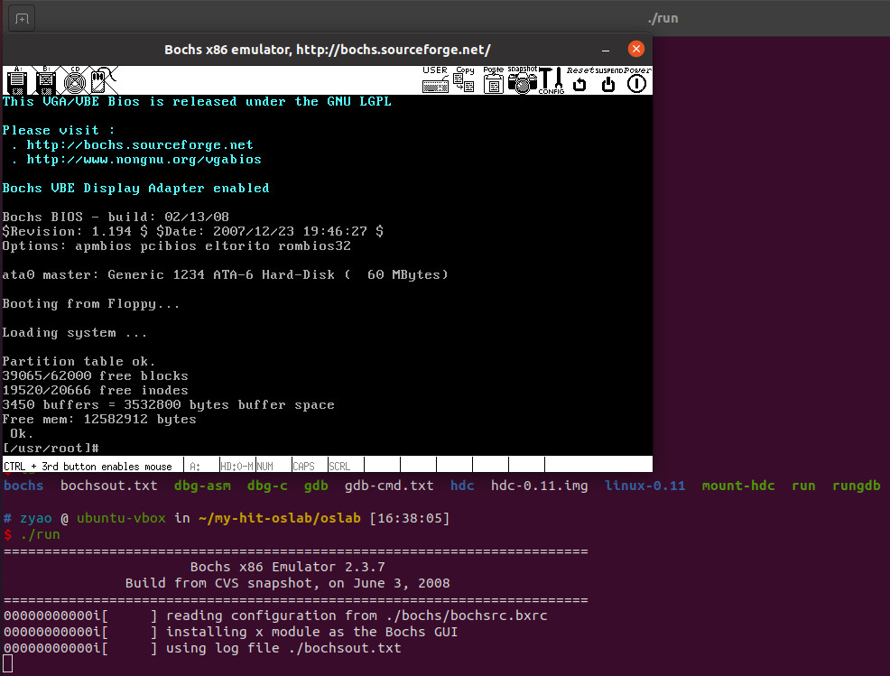

[哈工大操作系统实验手册](https://hoverwinter.gitbooks.io/hit-oslab-manual/content/)

[参考仓1](https://github.com/Wangzhike/HIT-Linux-0.11.git)

[参考仓2](https://github.com/hoverwinter/HIT-OSLab.git)


# 环境准备

- 安装gcc-3.4

  ```shell
  $ cd /tmp
  $ tar zxvf gcc-3.4-ubuntu.tar.gz
  $ cd gcc-3.4
  $ sudo ./inst.sh xxxx #xxxx换为i386或amd64
  $
  $ gcc-3.4 --version # 查看编译工具链是否安装正确
  gcc-3.4 (GCC) 3.4.6 (Ubuntu 3.4.6-8ubuntu2)
  ...
  ```

- 安装boches

  ```shell
  sudo apt-get install bochs bochs-x
  ```

- 安装其他必要工具

  ```shell
  # Install man page
  sudo apt-get install manpages-dev

  # Install bin86 that includes as86 and ld86 for compiling and linking bootsect.s and setup.s
  sudo apt-get install bin86
  
  # Install 32bit libs
  sudo apt-get install libc6-dev-i386 ia32-libs ia32-libs-gtk # lib32z1
  
  # Install compilation environment for C
  sudo apt-get install build-essential
  
  # Install libSM:i386 for bochs
  sudo apt-get install libsm6:i386
  
  # Install libX11-6:i386 for bochs
  sudo apt-get install libx11-6:i386
  
  # Install libxpm4:i386 for bochs
  sudo apt-get install libxpm4:i386
  ```
  
  

- Linux-0.11 编译

  ```shell
  # zyao @ ubuntu-vbox in ~/my-hit-oslab/oslab/linux-0.11 [15:59:17]
  $ make all
  ...
  
  $ make clean
  ...
  ```

- 环境验证

  

